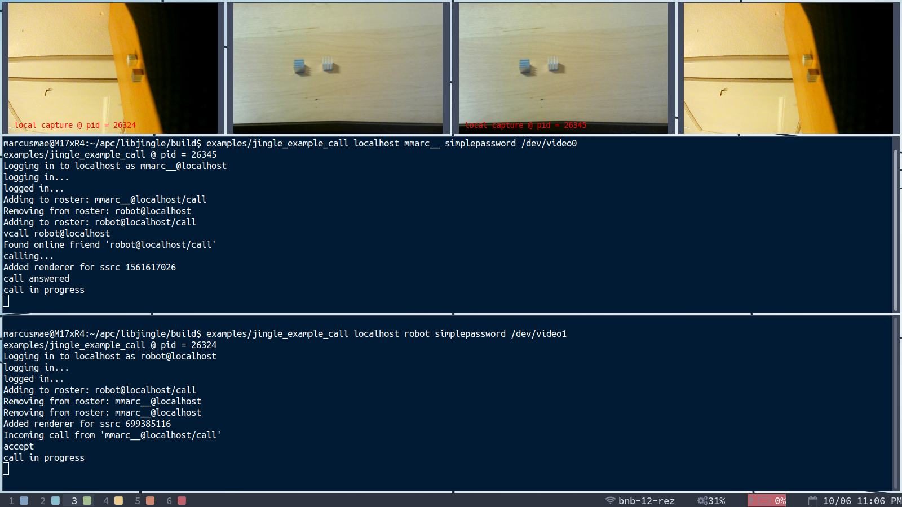

# Libjingle

Libjingle is a set of components to implement Jingle protocols [XEP-166](http://xmpp.org/extensions/xep-0166.html) and [XEP-167](http://xmpp.org/extensions/xep-0167.html). Libjingle was originally developed by Google for its [Goolge Talk service](http://code.google.com/apis/talk/call_signaling.html), which is no longer available. This package builds into a set of libraries that can still be used to develop XMPP clients.



```
|-base              - Contains basic low-level portable utility functions for
|                     things like threads and sockets
|-p2p               - The P2P stack
  |-base            - Base p2p functionality
  |-client          - Hooks to tie it into XMPP
|-session           - Signaling
  |-phone           - Signaling code specific to making phone calls
    |-testdata      - Samples of RTP voice and video dump
  |-tunnel          - Tunnel session and channel
|-third_party       - Folder for third party libraries
  |-libudev         - Folder containing libudev.h
|-xmllite           - XML parser
|-xmpp              - XMPP engine
```

In addition, this package contains two examples in talk/examples which illustrate the basic concepts of how the provided classes work.

## Building

Prerequisites:

```
sudo apt install g++ cmake libnss3-dev libasound2-dev gtk+2.0 libexpat-dev libsrtp-dev libnspr4-dev
```

Building from source with CMake:

```
git clone --recursive https://github.com/dmikushin/libjingle.git
cd libjingle
mkdir build
cmake ..
make -j48
```

## Testing

The source code comes with two major client application examples: `examples/login` and `examples/call`. In order to test them, you first need an XMPP server, e.g. prosody:

```
sudo apt install prosody
```

Prosody must be restricted to the recent TLS 1.2 (1.2+ for Prosody 0.10) in `/etc/prosody/conf.d/localhost.cfg.lua`:

```
-- Section for localhost

-- This allows clients to connect to localhost. No harm in it.
VirtualHost "localhost"
        ssl = {
                key = "/etc/prosody/certs/localhost.key";
                certificate = "/etc/prosody/certs/localhost.crt";
                protocol = "tlsv1_2+";
        }

-- Set up a MUC (multi-user chat) room server on conference.localhost:
Component "conference.localhost" "muc"
```

Create test users in prosody server and restart:

```
sudo prosodyctl register user localhost simplepassword
sudo prosodyctl register robot localhost simplepassword
sudo prosodyctl restart
```

Now a call example can connect to the server:

```
cd build/
examples/jingle_example_call localhost robot simplepassword
```

Execute another instance of test with a different username: `user@localhost`:

```
cd build/
examples/jingle_example_call localhost user simplepassword
```

In both instances of `jingle_example_call` type `join test@conference.localhost`. Both users shall be joined to the new `test` chart room. On behalf of `user` send a message to `robot` using `send` command:

```
send robot@localhost Hello
```

The username is cached, so subsequent messages can be sent with `send` omitting the username.

## Testing audio calls

In order to perform audio/video calls, users must be "friends", or "subscribed" to each other in terms of XMPP. The purpose of subscription is that is contains audio/video capabilities announcement needed for establishing calls.

Make `robot` and `user` friends of each other in the corresponding `example_call` sessions:

```
friend robot@localhost
friend user@localhost
```

Now ring a call from `user` to `robot` and accept it on behalf of `robot`:

```
call robot@localhost
accept
```

As long as both `user` and `robot` are running on the same `localhost` machine, you should hear your own voice with an infinite echo.

## Testing video calls

For testing video calls on localhost we need two cameras (unless you have some special system driver to share a single camera). Each of two users selects its dedicated camera upon startup:

```
examples/jingle_example_call localhost robot simplepassword /dev/video0
examples/jingle_example_call localhost user simplepassword /dev/video1
```

Make `robot` and `user` friends of each other in the corresponding `example_call` sessions:

```
friend robot@localhost
friend user@localhost
```

Now instead of audio `call` we do video `vcall`:

```
vcall robot@localhost
accept
```

Each of the two processes shall open two GTK windows: video from the local camera being broadcasted and video received from friend through the call. On the screenshot both users observe the same scene using two different cameras.

## Further testing

Libjingle also builds two server tools, a relay server and a STUN server. The relay server may be used to relay traffic when a direct peer-to-peer connection could not be established. The STUN Server implements the STUN protocol for Session Traversal Utilities for NAT(rfc5389), and the TURN server is in active development to reach compatibility with rfc5766. See the [Libjingle Developer Guide](http://developers.google.com/talk/libjingle/developer_guide) for information about configuring a client to use this relay server and this STUN server.

# Troubleshooting

## DNS errors in Prosody log

```
Sep 29 14:46:23 mod_s2s debug   First attempt to connect to locahost, starting with SRV lookup...
...
Sep 29 14:46:23 s2sout55c2a7467860      info    Failed in all attempts to connect to locahost
Sep 29 14:46:23 mod_s2s debug   No other records to try for locahost - destroying
Sep 29 14:46:23 s2sout55c2a7467860      debug   Destroying outgoing session localhost->locahost: DNS resolution failed
```

Prosody's roaster has cached a pending roster subscription request, which contains an invalid hostname, e.g. `robot@locahost`. It will appear in the log again and again, until the corresponding record in `/var/lib/prosody/localhost/roster` is deleted.

